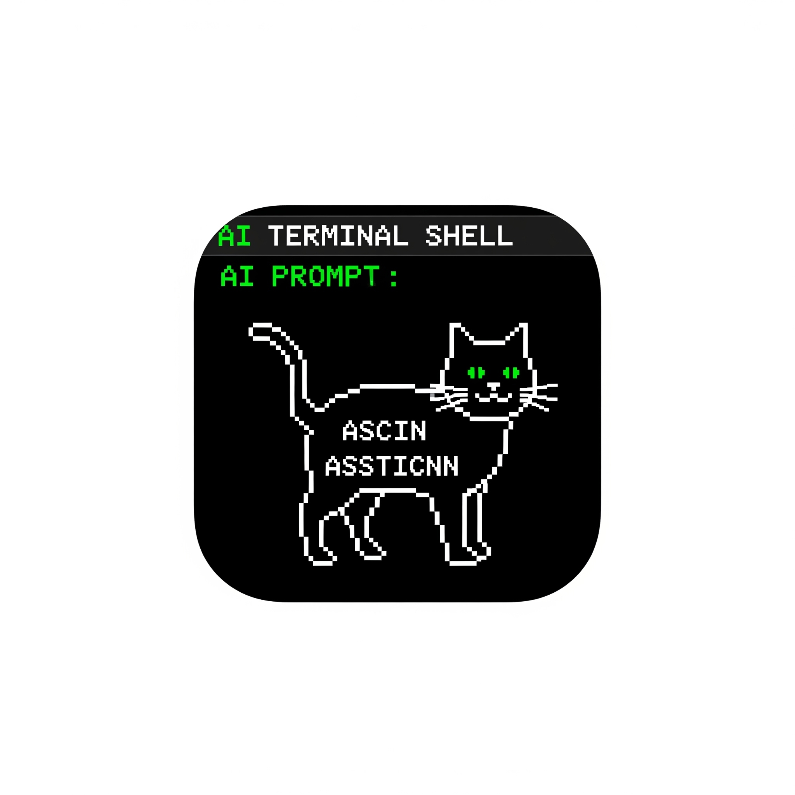

<div align="center">
  
  
  # AI Terminal Shell 🚀
  
  <p><strong>A powerful, AI-enhanced terminal application designed specifically for iPad</strong></p>
  <p>Combining the functionality of a traditional terminal with intelligent AI assistance powered by Claude AI</p>
  
  <div align="center">
    
    <h2>AI 터미널 셸 🚀</h2>
  </div>
  
  <p><strong>iPad를 위해 특별히 설계된 강력한 AI 강화 터미널 애플리케이션</strong></p>
  <p>전통적인 터미널의 기능과 Claude AI로 구동되는 지능형 AI 어시스턴트를 결합</p>
  
  <br>
  
  [](https://expo.dev)
  [](https://reactnative.dev)
  [](https://typescriptlang.org)
  [](https://anthropic.com)
  
  <br>
  
  
  
</div>

---

## 📱 Features / 기능

### 🖥️ Advanced Terminal Interface / 고급 터미널 인터페이스
- **Full Terminal Emulation**: Complete command-line interface with support for common Unix/Linux commands
- **완전한 터미널 에뮬레이션**: 일반적인 Unix/Linux 명령어를 지원하는 완전한 명령줄 인터페이스
- **Command History**: Navigate through previous commands with arrow keys
- **명령어 히스토리**: 화살표 키로 이전 명령어 탐색
- **Smart Autocomplete**: AI-powered command suggestions and completions
- **스마트 자동완성**: AI 기반 명령어 제안 및 완성
- **Syntax Highlighting**: Color-coded output for better readability
- **구문 강조**: 가독성 향상을 위한 색상 코딩된 출력
- **iPad Optimized**: Responsive design that adapts to different iPad screen sizes
- **iPad 최적화**: 다양한 iPad 화면 크기에 적응하는 반응형 디자인

### 🤖 AI-Powered Assistant / AI 기반 어시스턴트
- **Claude AI Integration**: Real-time assistance with terminal commands and system administration
- **Claude AI 통합**: 터미널 명령어 및 시스템 관리에 대한 실시간 지원
- **Intelligent Command Analysis**: Get detailed explanations of complex commands
- **지능형 명령어 분석**: 복잡한 명령어에 대한 상세한 설명 제공
- **Script Generation**: AI can help write and optimize shell scripts
- **스크립트 생성**: AI가 셸 스크립트 작성 및 최적화 지원
- **Security Auditing**: Advanced security analysis and recommendations
- **보안 감사**: 고급 보안 분석 및 권장사항 제공
- **Multi-language Support**: Available in 10+ languages including English, Korean, Japanese, Chinese
- **다국어 지원**: 영어, 한국어, 일본어, 중국어 등 10개 이상 언어 지원

### 🔐 SSH Connection Management / SSH 연결 관리
- **Multiple Connections**: Manage multiple SSH connections simultaneously
- **다중 연결**: 여러 SSH 연결을 동시에 관리
- **Key-based Authentication**: Support for SSH keys and certificates
- **키 기반 인증**: SSH 키 및 인증서 지원
- **Connection Profiles**: Save and organize server connections
- **연결 프로필**: 서버 연결 저장 및 정리
- **Secure Storage**: Encrypted credential storage
- **보안 저장소**: 암호화된 자격 증명 저장
- **Auto-reconnect**: Automatic reconnection to dropped connections
- **자동 재연결**: 끊어진 연결에 대한 자동 재연결

### ⚙️ Comprehensive Settings / 포괄적인 설정
- **Theme Customization**: Multiple terminal themes (Matrix Green, Cyberpunk Blue, etc.)
- **테마 커스터마이징**: 다양한 터미널 테마 (매트릭스 그린, 사이버펑크 블루 등)
- **Font Configuration**: Customizable fonts with ligature support
- **폰트 설정**: 리가처 지원이 포함된 커스터마이징 가능한 폰트
- **Security Options**: Enhanced security features and biometric authentication
- **보안 옵션**: 향상된 보안 기능 및 생체 인증
- **Data Management**: Export/import configurations and backup settings
- **데이터 관리**: 설정 내보내기/가져오기 및 백업 설정

## 🛠️ Technical Stack / 기술 스택

<div align="center">
  <table>
    <tr>
      <td align="center" width="100">
        
        <br><strong>App</strong>
      </td>
      <td align="center" width="100">
        
        <br><strong>React Native</strong>
      </td>
      <td align="center" width="100">
        
        <br><strong>Expo SDK 52</strong>
      </td>
      <td align="center" width="100">
        
        <br><strong>TypeScript</strong>
      </td>
    </tr>
  </table>
</div>

- **Framework**: React Native with Expo SDK 52
- **프레임워크**: Expo SDK 52를 사용한 React Native
- **Navigation**: Expo Router 4.0 with tab-based architecture
- **내비게이션**: 탭 기반 아키텍처를 사용한 Expo Router 4.0
- **AI Integration**: Claude AI (Anthropic) API
- **AI 통합**: Claude AI (Anthropic) API
- **Fonts**: Fira Code and Source Code Pro with Google Fonts
- **폰트**: Google Fonts를 사용한 Fira Code 및 Source Code Pro
- **Icons**: Lucide React Native
- **아이콘**: Lucide React Native
- **Storage**: AsyncStorage for local data persistence
- **저장소**: 로컬 데이터 지속성을 위한 AsyncStorage
- **Platform**: Web-first with iOS/Android support
- **플랫폼**: iOS/Android 지원이 포함된 웹 우선

## 📋 Prerequisites / 사전 요구사항

- Node.js 18+ 
- npm or yarn / npm 또는 yarn
- Expo CLI
- Claude AI API key (for AI features) / Claude AI API 키 (AI 기능용)

## 🚀 Installation / 설치

1. **Clone the repository / 저장소 복제**
   ```bash
   git clone https://github.com/yourusername/ai-terminal-shell.git
   cd ai-terminal-shell
   ```

2. **Install dependencies / 의존성 설치**
   ```bash
   npm install
   ```

3. **Set up environment variables / 환경 변수 설정**
   ```bash
   cp .env.example .env
   ```
   
   Edit `.env` and add your Claude AI API key:
   `.env` 파일을 편집하고 Claude AI API 키를 추가하세요:
   ```
   EXPO_PUBLIC_CLAUDE_API_KEY=your_claude_api_key_here
   ```

4. **Start the development server / 개발 서버 시작**
   ```bash
   npm run dev
   ```

## 🔧 Configuration / 설정

### Claude AI Setup / Claude AI 설정

1. Visit [Anthropic Console](https://console.anthropic.com/) / [Anthropic Console](https://console.anthropic.com/) 방문
2. Create an account and generate an API key / 계정 생성 및 API 키 생성
3. Add the API key to your `.env` file / `.env` 파일에 API 키 추가
4. Restart the application / 애플리케이션 재시작

### iPad Optimization / iPad 최적화

The app is specifically optimized for iPad with:
앱은 다음과 같은 iPad 전용 최적화를 제공합니다:
- Responsive layouts that adapt to different screen sizes / 다양한 화면 크기에 적응하는 반응형 레이아웃
- Touch-friendly interface elements / 터치 친화적인 인터페이스 요소
- Support for external keyboards / 외부 키보드 지원
- Split-screen and multitasking compatibility / 분할 화면 및 멀티태스킹 호환성

## 📱 Building for iPad / iPad용 빌드

### Development Build / 개발 빌드

```bash
# Install EAS CLI / EAS CLI 설치
npm install -g eas-cli

# Login to Expo / Expo 로그인
expo login

# Create development build / 개발 빌드 생성
eas build --platform ios --profile development
```

### Production Build / 프로덕션 빌드

```bash
# Build for App Store / App Store용 빌드
eas build --platform ios --profile production

# Submit to App Store / App Store 제출
eas submit --platform ios
```

## 🎯 Usage / 사용법

### Basic Terminal Commands / 기본 터미널 명령어

The app supports a wide range of terminal commands:
앱은 다양한 터미널 명령어를 지원합니다:

```bash
# File operations / 파일 작업
ls -la
cd /path/to/directory
cp file.txt backup.txt
mv old.txt new.txt

# System monitoring / 시스템 모니터링
ps aux
top
htop
df -h

# Network tools / 네트워크 도구
ping google.com
curl https://api.example.com
ssh user@server.com
```

### AI Assistant / AI 어시스턴트

Ask the AI assistant for help with:
AI 어시스턴트에게 다음과 같은 도움을 요청하세요:

```
"Explain the rsync command" / "rsync 명령어 설명해줘"
"How to secure SSH configuration" / "SSH 설정을 안전하게 하는 방법"
"Write a backup script" / "백업 스크립트 작성해줘"
"Analyze this error message" / "이 오류 메시지 분석해줘"
```

### SSH Connections / SSH 연결

1. Go to the Connections tab / 연결 탭으로 이동
2. Tap "Add Connection" / "연결 추가" 탭
3. Enter server details (host, port, username) / 서버 세부 정보 입력 (호스트, 포트, 사용자명)
4. Add SSH key if needed / 필요시 SSH 키 추가
5. Connect and start using the terminal / 연결 후 터미널 사용 시작

## 🔒 Security Features / 보안 기능

- **Encrypted Storage**: All credentials are encrypted locally
- **암호화된 저장소**: 모든 자격 증명이 로컬에서 암호화됨
- **Biometric Authentication**: Face ID/Touch ID support
- **생체 인증**: Face ID/Touch ID 지원
- **Secure Mode**: Enhanced security validations
- **보안 모드**: 향상된 보안 검증
- **SSH Key Management**: Secure key generation and storage
- **SSH 키 관리**: 안전한 키 생성 및 저장
- **Network Security**: SSL/TLS encryption for all communications
- **네트워크 보안**: 모든 통신에 대한 SSL/TLS 암호화

## 🌍 Internationalization / 국제화

Supported languages / 지원 언어:
- 🇺🇸 English / 영어
- 🇰🇷 Korean (한국어)
- 🇯🇵 Japanese (日本語)
- 🇨🇳 Chinese (中文)
- 🇪🇸 Spanish (Español)
- 🇫🇷 French (Français)
- 🇩🇪 German (Deutsch)
- 🇵🇹 Portuguese (Português)
- 🇷🇺 Russian (Русский)
- 🇸🇦 Arabic (العربية)

## 💰 Monetization / 수익화

The app includes a freemium model with:
앱은 다음과 같은 프리미엄 모델을 포함합니다:

<div align="center">
  <table>
    <tr>
      <th>Free Tier<br>무료 티어</th>
      <th>Pro Tier<br>프로 티어</th>
      <th>Enterprise Tier<br>엔터프라이즈 티어</th>
    </tr>
    <tr>
      <td>
        • Basic terminal functionality<br>기본 터미널 기능<br>
        • Limited AI queries<br>제한된 AI 쿼리<br>
        • Standard themes<br>표준 테마
      </td>
      <td>
        • Unlimited AI assistance<br>무제한 AI 지원<br>
        • Advanced features<br>고급 기능<br>
        • Custom themes<br>커스텀 테마<br>
        • Priority support<br>우선 지원
      </td>
      <td>
        • Team collaboration<br>팀 협업<br>
        • Custom integrations<br>커스텀 통합<br>
        • Advanced security<br>고급 보안<br>
        • 24/7 support<br>24/7 지원
      </td>
    </tr>
  </table>
</div>

## 🤝 Contributing / 기여

1. Fork the repository / 저장소 포크
2. Create a feature branch (`git checkout -b feature/amazing-feature`) / 기능 브랜치 생성
3. Commit your changes (`git commit -m 'Add amazing feature'`) / 변경사항 커밋
4. Push to the branch (`git push origin feature/amazing-feature`) / 브랜치에 푸시
5. Open a Pull Request / Pull Request 열기

## 📄 License / 라이선스

This project is licensed under the MIT License - see the [LICENSE](LICENSE) file for details.
이 프로젝트는 MIT 라이선스 하에 있습니다 - 자세한 내용은 [LICENSE](LICENSE) 파일을 참조하세요.

## 🙏 Acknowledgments / 감사의 말

- **Anthropic** for Claude AI API / Claude AI API 제공
- **Expo Team** for the excellent development framework / 훌륭한 개발 프레임워크 제공
- **Lucide** for beautiful icons / 아름다운 아이콘 제공
- **Google Fonts** for typography / 타이포그래피 제공
- **Open Source Community** for various libraries and tools / 다양한 라이브러리 및 도구 제공

## 📞 Support / 지원

- **Documentation**: [Wiki](https://github.com/ziholee/ai-terminal-shell/wiki) / **문서**: [위키](https://github.com/ziholee/ai-terminal-shell/wiki)
- **Issues**: [GitHub Issues](https://github.com/ziholee/ai-terminal-shell/issues) / **이슈**: [GitHub Issues](https://github.com/ziholee/ai-terminal-shell/issues)
- **Discussions**: [GitHub Discussions](https://github.com/ziholee/ai-terminal-shell/discussions) / **토론**: [GitHub Discussions](https://github.com/ziholee/ai-terminal-shell/discussions)
- **Email**: ???@gmail.com / **이메일**: ???@gmail.com

## 🗺️ Roadmap / 로드맵

- [ ] Apple Pencil support for annotations / 주석용 Apple Pencil 지원
- [ ] Vim/Nano editor integration / Vim/Nano 에디터 통합
- [ ] File manager with drag & drop / 드래그 앤 드롭 파일 매니저
- [ ] Terminal multiplexer (tmux) support / 터미널 멀티플렉서 (tmux) 지원
- [ ] Cloud sync for configurations / 설정 클라우드 동기화
- [ ] Plugin system for extensions / 확장용 플러그인 시스템
- [ ] Voice commands integration / 음성 명령 통합
- [ ] Collaborative terminal sessions / 협업 터미널 세션

---

<div align="center">
  
  <br>
  <strong>Made with ❤️ for developers who love the command line</strong>
  <br>
  <strong>명령줄을 사랑하는 개발자들을 위해 ❤️로 만들어졌습니다</strong>
</div>
